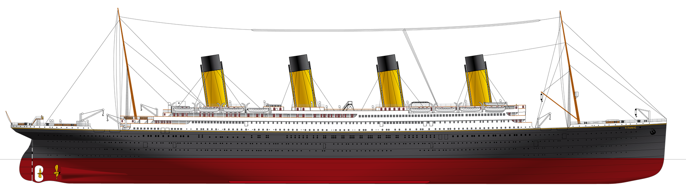

# The Titanic - ML from disaster

----

### Overview:
The data has been split into two groups:

- `train.csv` - The training set
- `test.csv` - The test set

----
### Data Dictionary
| `Variable` | Definition                      | Key                                            |
|------------|---------------------------------| ----------------------------------------------|
| `Survival` | Survival                        | 0 = No, 1 = Yes                                |
| `Pclass`   | Ticket class                    | 1 = 1st, 2 = 2nd, 3 = 3rd                      |
| `Sex`      | Sex                             |                                                |
| `Age`      | Age in years                    |                                                |
| `SibSp`    | No of siblings / spouses aboard |                                     |
| `Parch`    | No of parents / children aboard |                                    |
| `Ticket`   | Ticket number                   |                                                |
| `Fare`     | Passenger fare                  |                                                |
| `Cabin`    | Cabin number                    |                                                |
| `Embarked` | Port of Embarkation             | C = Cherbourg, Q = Queenstown, S = Southampton |

----

### Variable Notes

`Pclass`: A proxy for socio-economic status (SES)
- 1st = Upper
- 2nd = Middle
- 3rd = Lower

`Age`: Age is fractional if less than 1. If the age is estimated, is it in the form of xx.5

`SibSp`: The dataset defines family relations in this way...
- Sibling = brother, sister, stepbrother, stepsister
- Spouse = husband, wife (mistresses and fiancés were ignored)

`Parch`: The dataset defines family relations in this way...
- Parent = mother, father
- Child = daughter, son, stepdaughter, stepson

Some children travelled only with a nanny, therefore parch=0 for them.

----
